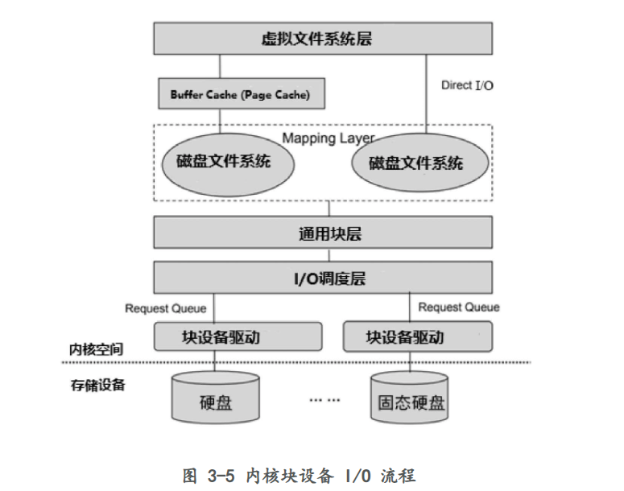

要理解Linux系统中`write`命令如何将数据写入磁盘，首先要从系统调用开始，逐步深入到内核内部，经过虚拟文件系统（VFS）、页缓存（Page Cache）、块设备层（Block Layer），再到I/O调度，最终将数据写入磁盘。以下是这个过程的详细描述：

### 1. 用户态到内核态的转换
- **系统调用（syscall）**: 当用户在应用程序中调用`write`时，程序通过系统调用进入内核态。这一过程通过特定的系统调用号和参数（如文件描述符、缓冲区地址、写入的字节数）进行。

### 2. VFS（虚拟文件系统）
- **文件对象**: `write`系统调用进入内核后，首先通过文件描述符找到对应的文件对象。VFS充当一个抽象层，使得内核可以支持多种不同的文件系统。
- **具体文件系统**: VFS根据文件对象调用具体文件系统的`write`操作，这可能是ext4、XFS、btrfs等文件系统的实现。

### 3. 页缓存（Page Cache）
- **缓存页（Page Cache）**: 内核通过页缓存来管理文件系统中的数据。`write`操作会将用户提供的数据拷贝到页缓存中，以提高I/O性能。
- **脏页（Dirty Pages）**: 页缓存中的页一旦被修改就被标记为“脏页”，这些数据还未写回磁盘。

### 4. 块设备层（Block Layer）
- **块设备I/O（Block I/O）**: 当需要将数据写入磁盘时，内核会将脏页组织成块I/O请求（BIO）。这些BIO包含了待写入的块号、数据缓冲区等信息。
- **BIO合并**: 为了优化I/O操作，内核可能会合并相邻的BIO请求，减少对磁盘的操作次数。

### 5. 请求队列和I/O调度器
- **请求队列（Request Queue）**: BIO请求会被放入对应块设备的请求队列中。这个队列保存了即将发送到硬盘的所有I/O请求。
- **I/O调度器（I/O Scheduler）**: 内核中的I/O调度器负责优化请求队列中的请求顺序。例如，Deadline、CFQ、BFQ等I/O调度算法可以根据不同的策略（如公平性、延迟、吞吐量）来排序请求，以提高磁盘的I/O性能。

### 6. 设备驱动程序
- **请求执行**: 调度器将排序后的请求发送给块设备驱动程序，驱动程序将这些请求转换为具体的硬件操作。
- **DMA和中断**: 磁盘驱动程序可能通过DMA（直接内存访问）将数据从内存传输到磁盘，并通过中断通知内核操作完成。

### 7. 数据写入磁盘
- **物理写入**: 最终，磁盘控制器将数据写入到指定的磁盘扇区中，完成实际的物理写入操作。
- **写回（Write-back）**: 如果数据被成功写入磁盘，内核将更新页缓存中对应页的状态，将其标记为干净（Clean）。

### 8. 更新元数据和同步
- **元数据更新**: 文件系统可能还需要更新文件的元数据（如大小、修改时间等）。这些元数据也会通过类似的路径写入磁盘。
- **同步（fsync）**: 应用程序可以调用`fsync`来确保数据已经物理写入磁盘，这会触发内核立即将所有脏页写回磁盘，确保数据安全。

### 总结
- **`write`调用**: 用户态的`write`调用引发系统调用，进入内核态。
- **VFS与文件系统**: 通过VFS与具体文件系统交互，处理写操作。
- **Page Cache**: 数据被写入页缓存，并标记为脏页。
- **BIO请求与I/O调度**: 脏页被组织成BIO请求，进入I/O调度器进行优化排序。
- **设备驱动与物理写入**: 经过调度的请求由设备驱动执行，最终写入磁盘。
- **数据一致性**: 内核通过同步机制（如`fsync`）确保数据一致性。

这个流程涵盖了从用户调用到数据最终落盘的主要步骤和机制。