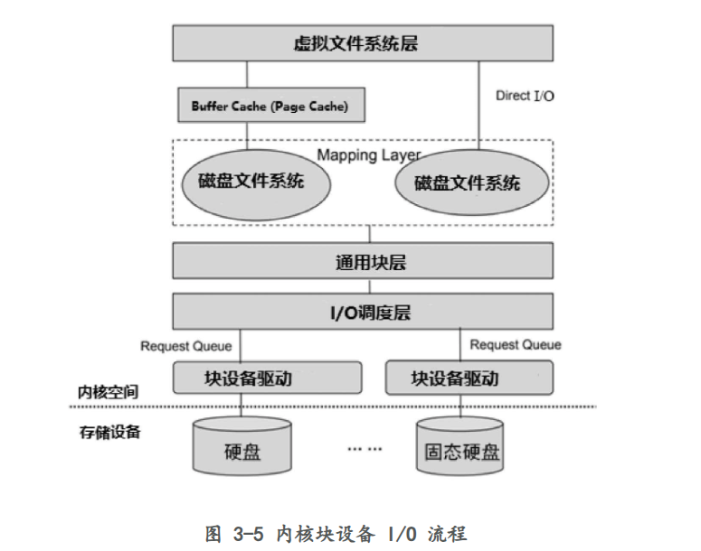

块设备层（Block Layer）是Linux内核中负责管理块设备（如硬盘、SSD等）I/O操作的一个关键部分。它位于文件系统和设备驱动程序之间，提供了一个统一的接口，处理来自文件系统的I/O请求，并将这些请求传递给底层的块设备驱动。以下是块设备层的主要工作及其各个组成部分的详细说明：

### 1. **块I/O请求（BIO Request）的管理**
   - **BIO结构体**: BIO（Block I/O）结构体是块设备层的基本数据结构，用于描述一次块设备I/O操作。一个BIO可以包含多个页的读写操作，描述了这些操作的目标块地址、数据缓冲区、操作类型（读或写）等。
   - **BIO创建与合并**: 当文件系统需要写入数据时，会将数据打包成BIO请求。如果相邻的BIO请求操作同一设备并且相邻或重叠的块，内核会尝试将它们合并成一个更大的BIO，以减少I/O操作的开销。
   - **BIO分解与拆分**: 如果一个BIO请求的大小超出了设备能够处理的范围，块设备层会将其拆分成多个小BIO请求，以适应硬件的限制。

### 2. **请求队列（Request Queue）的管理**
   - **请求队列结构体**: 每个块设备对应一个请求队列（Request Queue），该队列存储了所有等待被处理的BIO请求。请求队列结构体中记录了设备的状态、I/O调度策略、队列深度等信息。
   - **插入队列**: 当BIO请求准备好后，块设备层会将其插入到对应的请求队列中，等待进一步处理。插入时，根据I/O调度策略可能会立即进行排序。

### 3. **I/O调度器（I/O Scheduler）**
   - **调度策略**: 块设备层提供了多种I/O调度器，如CFQ（完全公平队列）、Deadline、NOOP等，每种调度器都有其特定的优化策略。调度器的作用是在队列中的BIO请求被执行前，对其顺序进行优化，以提高磁盘I/O性能。
     - **CFQ（Completely Fair Queuing）**: 尽量公平地分配I/O带宽给不同的进程。
     - **Deadline**: 通过设置请求的超时时间，保证请求不会被长时间延迟。
     - **NOOP**: 一个简单的调度器，只是按FIFO顺序处理请求，适用于不需要复杂调度的场景。
   - **调度与合并**: 调度器不仅管理请求的排序，还可能进一步合并相邻的BIO请求，以减少磁盘头移动，提高吞吐量。

### 4. **请求的分发与执行**
   - **分发请求**: I/O调度器在决定了请求的执行顺序后，将请求发送到对应的设备驱动程序。设备驱动接收到这些请求后，负责与硬件交互，执行具体的读写操作。
   - **异步与同步I/O**: 块设备层可以支持同步和异步I/O操作。对于异步I/O，内核将请求发送到设备后，不等待其完成，立即返回给上层应用程序。设备完成操作后通过中断或轮询机制通知内核。

### 5. **错误处理与重试机制**
   - **错误检测**: 如果I/O操作在执行过程中遇到错误，如设备故障或数据传输问题，块设备层会检测到这些错误。
   - **重试与回退**: 根据错误类型，块设备层可能会重试操作或回退到更简单的I/O调度策略以确保数据安全性。例如，如果一个写操作失败，内核可能会重试操作，或将BIO拆分成更小的请求，尝试部分完成操作。
   - **错误报告**: 如果最终操作失败，块设备层会将错误报告给上层文件系统，文件系统再将错误信息反馈给应用程序。

### 6. **数据的一致性与缓存策略**
   - **写回（Write-back）与写通（Write-through）**: 块设备层支持不同的缓存策略。写回模式下，数据先写入缓存，稍后再写入磁盘；写通模式下，数据立即写入磁盘。这些策略影响数据一致性和I/O性能。
   - **缓存刷回**: 当缓存中的数据达到一定条件（如占用过多内存或超时），内核会触发刷回机制，将脏数据写入磁盘，以保证数据的持久性。

### 7. **设备特性处理**
   - **请求整形**: 不同的块设备有不同的I/O特性，如扇区大小、队列深度等。块设备层根据这些特性对BIO请求进行整形，以适应设备的特定要求。
   - **队列深度管理**: 块设备层根据设备支持的并发I/O数量管理队列深度，确保设备不被过载，同时也能充分利用设备的I/O能力。

### 8. **多队列（Multi-Queue Block I/O Queuing, MQ）**
   - **多队列机制**: 现代Linux内核支持多队列块I/O机制（MQ），允许多个I/O队列同时存在并行处理I/O请求。每个CPU可以拥有一个I/O队列，从而减少锁竞争，提高多核系统的I/O吞吐量。
   - **设备驱动适配**: 多队列机制要求设备驱动程序支持多队列架构，能够同时处理多个队列中的请求，进一步优化I/O性能。

### 总结
块设备层在Linux内核中充当文件系统与实际硬件设备之间的桥梁，管理从BIO请求的生成与合并、请求队列的管理、I/O调度、错误处理、数据一致性保障，到最终将请求分发给设备驱动并执行，确保高效且可靠的I/O操作。

